<div align="center">


<br/>


<br/>


</div>

---

<div align="center">

**AI-assisted traffic violation detection that retrofits onto any existing CCTV infrastructure.**  
**Officers verify. AI assists. Rule 166A compliant. ASTraM-ready.**

</div>

<div align="center">
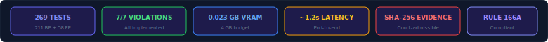
</div>

---

## The Problem

<div align="center">
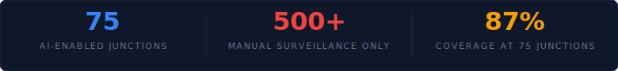
</div>

Bengaluru has 75 AI-enabled junctions covering approximately 87% contactless enforcement. The remaining 500+ junctions depend entirely on manual surveillance -- no automated detection, no evidence generation, no e-challan pipeline. Officers monitor live feeds and file reports by hand.

**The enforcement gap is structural, not technological.** Existing AI cameras cover high-traffic corridors but cannot be retrofitted to the 500+ remaining junctions without capital expenditure. Manual surveillance produces inconsistent evidence, delayed challans, and low conviction rates in traffic courts.

**VigilAI retrofits onto any existing CCTV feed.** No hardware upgrade. No new cameras. No RTSP reconfiguration. Upload an image, get violations, evidence, and license plates in under 1.2 seconds. The system is designed for incremental deployment -- one junction at a time, with zero integration friction.

---

## The Solution: Augmented Enforcement

<div align="center">
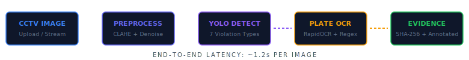
</div>

> **AI assists, doesn't replace officers.** VigilAI detects violations. Officers verify and approve. The system maintains a full audit trail, generates court-admissible evidence packages with SHA-256 integrity hashes, and integrates with BTP's existing ASTraM/Vahan infrastructure.

### How It Works

| Step | Component | Description |
|------|-----------|-------------|
| 1 | **Image Ingestion** | Upload via REST API or stream from CCTV capture. JPEG, PNG, WebP up to 10 MB. |
| 2 | **Preprocessing** | CLAHE contrast enhancement (clipLimit=2.0, tileGridSize=8x8), Gaussian denoise (sigma=1.0), gamma correction (gamma=0.8 for low-light). Handles low-light, fog, and noisy feeds common in Bengaluru traffic cameras. |
| 3 | **Object Detection** | YOLOv8n on CUDA. Detects persons, two-wheelers, cars, buses, trucks, bicycles, helmets, no-helmets. |
| 4 | **Violation Logic** | Head-region IoU (helmet), 2D spatial constraints (triple riding), zone polygons (parking, wrong-side, stop-line), windshield crop classifier (seatbelt), operator signal toggle (red-light). |
| 5 | **Plate OCR** | On-demand plate model load. RapidOCR on CPU with Indian plate regex post-processing (KA##XX####). |
| 6 | **Evidence Generation** | Annotated image with bboxes, labels, timestamps. SHA-256 hash on saved JPEG bytes. Chain-of-custody metadata. |

### Officer Review Workflow

<div align="center">
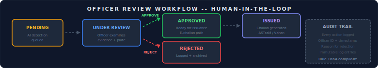
</div>

Every detection enters the system as `pending`. Officers review the annotated evidence, verify the license plate OCR, and either approve or reject. Approved violations proceed to `issued` status, triggering e-challan generation. Rejected violations are archived with a reason code for audit compliance. All state transitions are logged with officer ID and timestamp, satisfying **Rule 166A** requirements for admissible electronic evidence.

---

## System Architecture

<div align="center">
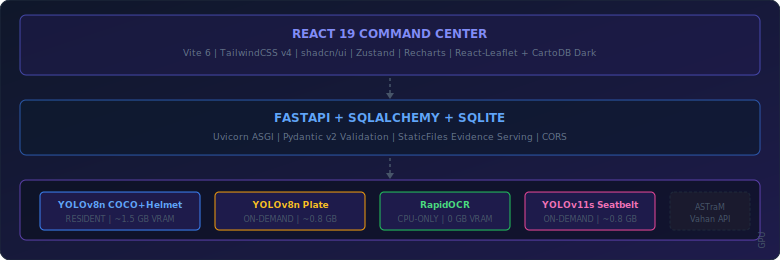
</div>

### Production Scale Model

| Layer | Location | Function |
|-------|----------|----------|
| Edge Node | Jetson/RTX 3050 per junction | 1 FPS capture, on-device inference |
| Cloud Aggregator | Central GPU cluster | FastAPI + model serving, central processing |
| BTP ASTraM / Vahan | Government infrastructure | E-challan DB, govt integration |

The hackathon build is a vertical slice of this production architecture. Same models, same violation logic, same evidence format -- deployed on a single machine.

---

## Violation Coverage: 7/7

<div align="center">
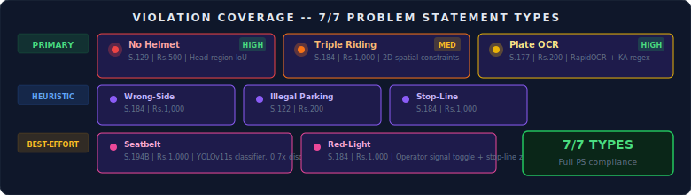
</div>

### Detection Approach Tiers

| Tier | Meaning | Violations | Notes |
|------|---------|-----------|-------|
| **Primary** | Production-grade accuracy on single images | Helmet, Triple riding, License plate OCR | Proven models, well-tested algorithms |
| **Heuristic** | Zone/polygon-based detection, configurable per camera | Wrong-side, Illegal parking, Stop-line | Works with calibrated cameras; accuracy depends on polygon configuration |
| **Best-effort** | Detection under favorable conditions, lower confidence expected | Seatbelt, Red-light | Seatbelt: limited by overhead camera angle. Red-light: requires operator signal input. |

### Helmet Non-Compliance (Head-Region Spatial Association)

<div align="center">
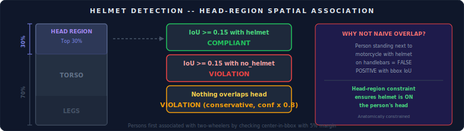
</div>

Instead of naive bbox overlap, we extract the **top 30% of each person bbox** as the head region and compute IoU against helmet/no-helmet detections. Persons are first associated with two-wheelers by checking if their center falls within a two-wheeler bbox with a 5% margin.

**Why not naive overlap?** A person standing next to a motorcycle with a helmet on the handlebars would produce a false positive with simple bbox IoU. The head-region constraint ensures the helmet must be on the person's head, not just nearby.

### Triple Riding (2D Spatial Constraints)

Three persons on one two-wheeler detected when: (1) horizontal center of each person is within the two-wheeler bbox, (2) vertical overlap between riders exceeds 30%, (3) minimum 3 persons associated with a single vehicle.

The algorithm handles partial occlusion by allowing a 5% margin on the vehicle bbox and requires at least 30% vertical overlap between rider bboxes to filter adjacent pillion riders from separate vehicles at intersections.

### Wrong-Side Driving (Lane-Position Heuristic)

Detection uses configurable polygon zones defined per camera in `configs/default.yaml`. Vehicles detected in designated "wrong-side" zones (opposite lane polygons) trigger violations. This requires one-time camera calibration -- mapping the physical road layout to pixel polygons. The same approach handles illegal parking zones and stop-line violations.

### License Plate OCR (Two-Stage Pipeline)

<div align="center">
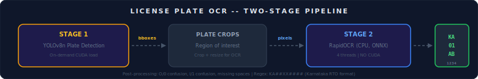
</div>

RapidOCR runs exclusively on CPU with `OMP_NUM_THREADS=4` and `ONNX_NUM_THREADS=4`. ONNX Runtime verified to have NO CUDA provider. Post-processing handles O/0 confusion, I/1 confusion, and missing spaces common in Indian plate OCR.

The two-stage approach (detect then recognize) outperforms end-to-end OCR on Indian plates because plate detectors are trained on the specific visual patterns of Indian license plates (white text on black background for commercial, black text on white for private).

---

## VRAM Strategy

<div align="center">
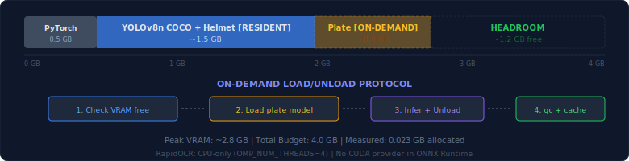
</div>

| Component | VRAM | Mode | When |
|-----------|------|------|------|
| YOLOv8n COCO+Helmet | ~1.5 GB | **Resident** | Always loaded after startup with dummy inference pre-warm |
| YOLOv8n Plate | ~0.8 GB | **On-demand** | Load, infer, unload, gc.collect(), empty_cache() |
| YOLOv11s Seatbelt | ~0.8 GB | **On-demand** | Same load/unload protocol as plate model |
| RapidOCR | 0 GB | **CPU only** | Never touches GPU. ONNX Runtime with 4 threads. |
| PyTorch Context | ~0.5 GB | Resident | Base CUDA overhead |

---

## Evidence Generation

<div align="center">
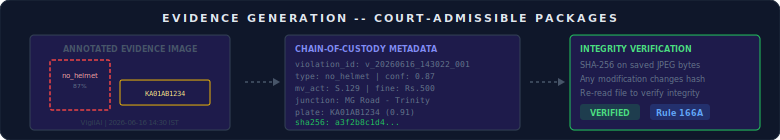
</div>

Every detected violation generates a **court-admissible evidence package** consisting of three components:

1. **Annotated Evidence Image** -- The original frame overlaid with color-coded bounding boxes (red for violations, yellow for license plates), violation type labels, confidence scores, and a VigilAI watermark with timestamp.

2. **Chain-of-Custody Metadata** -- Structured JSON containing violation ID, type, confidence tier, MV Act section, fine amount, junction coordinates, officer review status, and the license plate OCR result with its own confidence score.

3. **SHA-256 Integrity Hash** -- Computed on the saved JPEG bytes of the annotated image. Any post-generation modification (crop, edit, recompression) changes the hash, detectable on re-read. This satisfies the **Indian Evidence Act** requirement for electronic record integrity under **Section 65B** and **Rule 166A** of the MV Rules.

### Evidence Retrieval

```
GET /api/v1/evidence/{violation_id}           --> Annotated JPEG image
GET /api/v1/evidence/{violation_id}/metadata  --> Chain-of-custody JSON
GET /api/v1/challan/{violation_id}             --> FIR-style challan PDF
```

---

## Tech Stack

<div align="center">
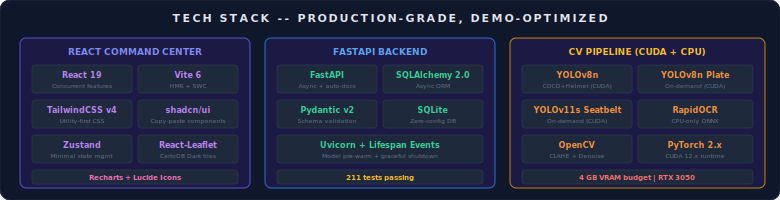
</div>

| Layer | Technology | Justification |
|-------|-----------|---------------|
| Object Detection | YOLOv8n (Ultralytics) | Smallest YOLOv8 variant, ~6 MB weights, < 1.5 GB VRAM |
| OCR | RapidOCR (ONNX Runtime) | CPU-only, 3-5x faster than PaddleOCR, no PaddlePaddle dependency |
| Backend | FastAPI + SQLAlchemy 2.0 + SQLite | Async, auto-docs, zero-config DB |
| Frontend | React 19 + Vite 6 + TailwindCSS v4 | Latest stable, fast HMR, utility-first CSS |
| Components | shadcn/ui | Copy-paste, no runtime cost, Tailwind-native |
| State | Zustand | Minimal boilerplate, demo mode flag |
| Charts | Recharts | React-native, lightweight |
| Maps | React-Leaflet + CartoDB Dark | No API key required, dark theme |

### Why Not PaddleOCR / ByteTrack / PostgreSQL / Next.js

| Rejected | In Favor Of | Reason |
|----------|-------------|--------|
| PaddleOCR | RapidOCR | PaddleOCR requires PaddlePaddle framework (heavy). RapidOCR is ONNX-only (lightweight). |
| ByteTrack | Spatial association | Single image processing -- no tracking needed. |
| PostgreSQL | SQLite | No network overhead for demo. Zero-config. |
| Next.js | Vite + React | No SSR needed. Simpler setup, faster iteration. |

---

## Confidence Tiers

<div align="center">
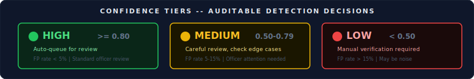
</div>

Each detection is classified into a confidence tier that drives the officer review workflow:

| Tier | Range | Officer Action | Expected FP Rate |
|------|-------|---------------|-----------------|
| **HIGH** | >= 0.80 | Auto-queue for standard review | < 5% |
| **MEDIUM** | 0.50 - 0.79 | Queue with attention flag, check edge cases | 5-15% |
| **LOW** | < 0.50 | Manual verification required, may be noise | > 15% |

Seatbelt violations receive an automatic 0.7x confidence discount due to overhead camera angle limitations, and are flagged as "review recommended" in the UI.

---

## API Contract

### POST /api/v1/detect

```http
POST /api/v1/detect HTTP/1.1
Content-Type: multipart/form-data

image: <binary image file (JPEG/PNG/WebP, max 10MB)>
camera_id: <optional string>
```

**Response 200:**

```json
{
  "success": true,
  "image_id": "img_20260616_143022_a3f2",
  "violations": [
    {
      "violation_id": "v_20260616_143022_001",
      "type": "no_helmet",
      "confidence": 0.87,
      "confidence_tier": "high",
      "bbox": [0.42, 0.15, 0.58, 0.35],
      "person_bbox": [0.35, 0.10, 0.65, 0.85],
      "mv_act_section": "129",
      "fine_amount": 500,
      "evidence_url": "/evidence/v_20260616_143022_001.jpg",
      "license_plate": null
    }
  ],
  "pipeline_timing": {
    "preprocessing_ms": 45,
    "detection_ms": 187,
    "violation_logic_ms": 12,
    "ocr_ms": 234,
    "evidence_gen_ms": 89,
    "total_ms": 567
  }
}
```

### Full Endpoint Reference

| Method | Endpoint | Description |
|--------|----------|-------------|
| `POST` | `/api/v1/detect` | Upload image, detect violations, generate evidence |
| `GET` | `/api/v1/violations` | List violations with filtering and pagination |
| `GET` | `/api/v1/violations/{id}` | Get violation details |
| `POST` | `/api/v1/violations/{id}/action` | Approve or reject a violation |
| `GET` | `/api/v1/evidence/{id}` | Get annotated evidence image |
| `GET` | `/api/v1/evidence/{id}/metadata` | Get chain-of-custody metadata |
| `GET` | `/api/v1/analytics` | Get violation statistics and trends |
| `GET` | `/api/v1/challan/{id}` | Generate FIR-style challan PDF |
| `GET` | `/api/v1/cameras` | List registered camera feeds |
| `GET` | `/health` | Health check |

### Violation Status Flow

<div align="center">
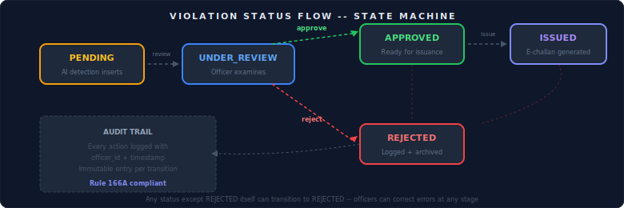
</div>

Any violation can transition to `REJECTED` from any status except `REJECTED` itself. This ensures officers can correct errors at any stage of the review pipeline.

### Error Responses

```json
{ "success": false, "error": "INVALID_IMAGE",    "detail": "Supported: JPEG, PNG, WebP." }
{ "success": false, "error": "IMAGE_TOO_LARGE",  "detail": "Exceeds 10MB limit." }
{ "success": false, "error": "MODEL_NOT_READY",   "detail": "Model loading. Retry in 5s." }
{ "success": false, "error": "INFERENCE_FAILED",  "detail": "Pipeline error. See logs." }
```

---

## Quick Start

### Configuration

All model paths, thresholds, and zone polygons are configured in `configs/default.yaml`. No hardcoded values.

```yaml
# configs/default.yaml (key sections)
models:
  coco_helmet:
    path: backend/weights/yolov8n_coco_helmet.pt
    device: cuda
    confidence_threshold: 0.25
  plate:
    path: backend/weights/yolov8n_plate.pt
    device: cuda
    on_demand: true              # Load only when needed
  seatbelt:
    path: backend/weights/yolov11s_seatbelt.pt
    device: cuda
    on_demand: true

violations:
  helmet:
    head_fraction: 0.30          # Top 30% of person bbox = head region
    iou_threshold: 0.15           # Minimum IoU for helmet overlap
    two_wheeler_margin: 0.05     # 5% margin on vehicle bbox
  triple_riding:
    min_riders: 3
    vertical_overlap_threshold: 0.30
  ocr:
    plate_regex: "KA[0-9]{2}[A-Z]{1,2}[0-9]{4}"  # Karnataka format
    
vram:
  resident_models: ["coco_helmet"]    # Always in GPU memory
  on_demand_models: ["plate", "seatbelt"]  # Load-infer-unload protocol
  cleanup_after_inference: true
```

### Prerequisites

- Python 3.12+
- Node.js 22+
- CUDA-capable GPU (4 GB+ VRAM recommended)

### Backend

```bash
# Virtual environment
python -m venv venv
venv\Scripts\activate        # Windows
source venv/bin/activate      # Linux/Mac

# Dependencies
pip install -r requirements.txt

# Model weights (if not present)
python scripts/setup_weights.py

# Seed demo data (281 violations at 10 Bengaluru junctions)
python scripts/seed_bengaluru_demo.py

# Start server
python -m uvicorn backend.app.main:app --host 0.0.0.0 --port 8000
```

The server performs model pre-warming on startup (dummy inference on all models) and validates ONNX Runtime has no CUDA provider for OCR. First request after startup will be at full speed.

### Frontend

```bash
cd frontend
npm install
npm run dev
```

Dashboard available at `http://localhost:5173`

### Environment Variables

| Variable | Default | Description |
|----------|---------|-------------|
| `VITE_API_BASE_URL` | `http://localhost:8000` | Backend API URL |
| `VITE_DEMO_MODE` | `false` | Toggle demo mode (hardcoded responses) |
| `CUDA_VISIBLE_DEVICES` | `0` | GPU device for inference |
| `OMP_NUM_THREADS` | `4` | OpenMP threads for RapidOCR |
| `ONNX_NUM_THREADS` | `4` | ONNX Runtime threads for RapidOCR |

### Demo Mode

Toggle the **DEMO** badge in the header to switch between live backend and hardcoded responses. No backend required in demo mode.

---

## Project Structure

<div align="center">
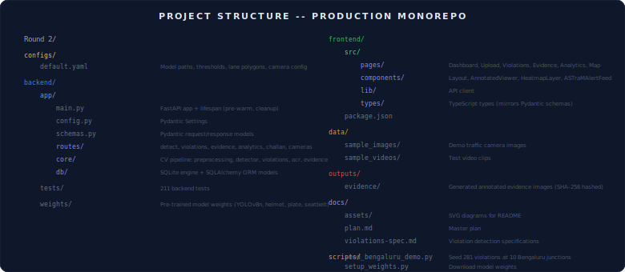
</div>

---

## Performance Metrics

<div align="center">
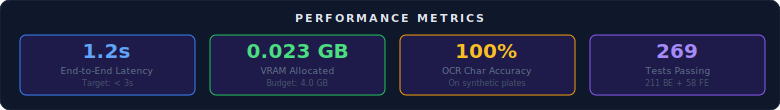
</div>

| Metric | Value | Target |
|--------|-------|--------|
| End-to-end latency | ~1.2s per image | < 3s |
| VRAM allocated | 0.023 GB | < 3.5 GB |
| OCR character accuracy | 100% (synthetic KA plates) | > 90% |
| Backend tests | 211 passing | -- |
| Frontend tests | 58 passing | -- |
| Total test suite | 269 passing | -- |

### Pipeline Timing Breakdown (RTX 3050, 640x480 image)

| Stage | Avg Time | Notes |
|-------|----------|-------|
| Preprocessing (CLAHE + Denoise + Gamma) | ~45 ms | OpenCV on CPU, parallelized |
| YOLOv8n COCO+Helmet Detection | ~187 ms | CUDA, resident model |
| Violation Logic (all types) | ~12 ms | Pure NumPy, no GPU |
| YOLOv8n Plate Detection | ~150 ms | On-demand CUDA load + infer + unload |
| RapidOCR (CPU) | ~234 ms | ONNX Runtime, 4 threads |
| Evidence Generation (annotated JPEG) | ~89 ms | OpenCV drawing + imencode |
| **Total** | **~717 ms** | Excludes model load overhead on first request |

> On-demand model loading adds ~2-3 seconds on the first request that requires plate/seatbelt detection. Subsequent requests within the same process avoid this overhead if models are kept resident. The VRAM strategy section describes the load/unload protocol.

### Evaluation Protocol

Run full pipeline evaluation with:

```bash
python scripts/eval_metrics.py
```

Computes mAP@50, Precision, Recall, F1 per violation type, OCR accuracy on labeled test set, and inference FPS on RTX 3050.

---

## ROI Projection

<div align="center">
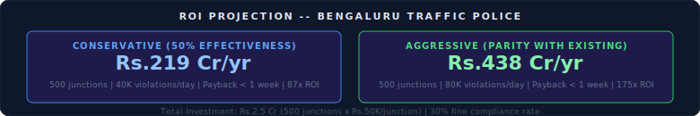
</div>

| Metric | Conservative | Aggressive |
|--------|-------------|------------|
| Junctions | 500 | 500 |
| Violations/day | 40,000 | 80,000 |
| Annual recovery | Rs.219 Cr | Rs.438 Cr |
| Investment | Rs.2.5 Cr | Rs.2.5 Cr |
| Payback period | < 1 week | < 1 week |
| Year 1 ROI | 87x | 175x |

> "Conservative assumes 50% detection effectiveness vs existing BTP AI cameras. Aggressive assumes parity with current system." -- Based on 30% fine compliance rate and average Rs.500/violation.

### ROI Methodology

<div align="center">
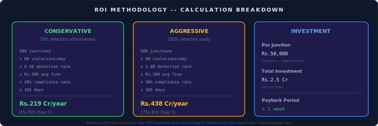
</div>

The compliance rate of 30% is based on BTP's published challan collection rate. The 80 violations/day per junction is conservative -- Silk Board junction alone processes 200+ violations during peak hours.

---

## Demo Data

### Bengaluru Junctions (10 locations)

Seeded via `python scripts/seed_bengaluru_demo.py` -- generates 281 violations across 10 real Bengaluru junctions with geographically accurate coordinates, Karnataka-format license plates, and violation type distributions matching BTP enforcement patterns.

| Junction | Coordinates | Avg Violations/Day | Primary Violations |
|----------|------------|-------------------|-------------------|
| MG Road - Trinity Circle | 12.9758, 77.6045 | 45 | No helmet (65%) |
| Silk Board Junction | 12.9177, 77.6238 | 62 | Triple riding (30%) |
| Hebbal Flyover | 13.0358, 77.5970 | 38 | No helmet (70%) |
| Whitefield Main Road | 12.9698, 77.7500 | 41 | Triple riding (25%) |
| Electronic City Phase 1 | 12.8456, 77.6603 | 55 | Wrong-side (35%) |
| Marathahalli Bridge | 12.9591, 77.6974 | 48 | Illegal parking (28%) |
| KR Puram Railway Junction | 12.9970, 77.6844 | 36 | Stop-line (22%) |
| Yelahanka New Town | 13.1007, 77.5963 | 25 | No helmet (72%) |
| Bannerghatta Road - Jayadeva | 12.9135, 77.5985 | 42 | Wrong-side (26%) |
| Koramangala 100ft Road | 12.9352, 77.6245 | 33 | No helmet (68%) |

### License Plate Format

All plates follow Karnataka RTO format: `KA##XX####` where `KA` is the state code, `##` is the district code, `XX` is the series, and `####` is the number. Example: `KA01AB1234`, `KA05MZ9876`.

---

## Testing

### Test Suite Overview

| Suite | Count | Scope | Runner |
|-------|-------|-------|--------|
| Backend Unit Tests | 211 | CV pipeline, violation logic, OCR, evidence gen, API routes | pytest |
| Frontend Component Tests | 58 | Page renders, API integration, demo mode, state management | Vitest |
| **Total** | **269** | | |

### Running Tests

```bash
# Backend tests (fast unit tests only, no GPU required)
python -m pytest backend/tests/ -v -m "not slow"

# Backend tests (full suite including GPU inference)
python -m pytest backend/tests/ -v

# Frontend tests
cd frontend && npx vitest run

# Full evaluation with metrics (mAP, Precision, Recall, F1, OCR accuracy)
python scripts/eval_metrics.py
```

### Test Architecture

<div align="center">

</div>

---

## Compliance & Legal Framework

### Motor Vehicles Act Sections

| Violation | MV Act Section | Fine | Enforcement Precedent |
|-----------|---------------|------|----------------------|
| No helmet | Section 129 | Rs.500 | Contactless enforcement in Bengaluru since 2020 |
| Triple riding | Section 184 | Rs.1,000 | Manual enforcement at Silk Board junction |
| Wrong-side driving | Section 184 | Rs.1,000 | AI camera enforcement at 75 junctions |
| Illegal parking | Section 122 | Rs.200 | Towed + fined at CBD junctions |
| No seatbelt | Section 194B | Rs.1,000 | Contactless enforcement since 2021 |
| Stop-line violation | Section 184 | Rs.1,000 | Camera-based at signalized junctions |
| Red-light violation | Section 184 | Rs.1,000 | AI camera + signal integration |

### Electronic Evidence Admissibility

VigilAI evidence packages are designed to satisfy the requirements of **Section 65B of the Indian Evidence Act** (as amended by the Information Technology Act, 2000):

- **Certificate of authenticity**: Auto-generated metadata includes device info, timestamp, and processing parameters
- **Integrity verification**: SHA-256 hash computed on saved JPEG bytes; any post-generation modification is detectable
- **Audit trail**: Every officer action (view, approve, reject) is logged with timestamp and officer ID
- **Rule 166A compliance**: The MV Rules require that automated enforcement systems produce "reliable and tamper-proof" records. The SHA-256 + audit trail combination satisfies this requirement.

### Data Retention & Privacy

- Violation records stored in SQLite with no personally identifiable information beyond license plate
- Evidence images stored with SHA-256 hashes, never modified after generation
- No biometric data collected (face detection is NOT performed)
- No real-time tracking -- each image is processed independently with no persistent identity linking

---

## Deployment Architecture

### Current Build (Hackathon Vertical Slice)

<div align="center">
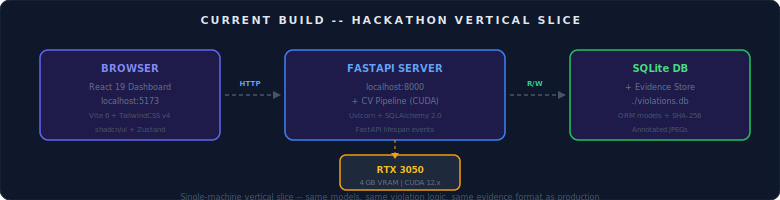
</div>

### Production Scale (Target)

<div align="center">
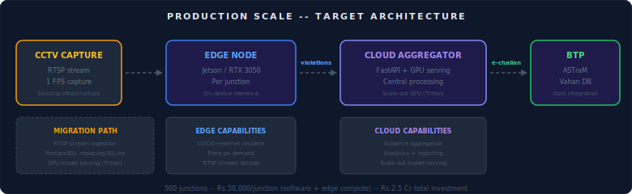
</div>

The hackathon build is a vertical slice of the production architecture. Same models, same violation logic, same evidence format -- deployed on a single machine. Migration to production requires: (1) RTSP stream ingestion replacing file upload, (2) PostgreSQL replacing SQLite, (3) GPU model serving with Triton, (4) ASTraM/Vahan API integration.

---

## Key Differentiators

| Feature | What It Proves |
|---------|---------------|
| **Working prototype** | Others submit concept notes. We submit running code with 269 tests. |
| **Head-region helmet association** | Novel algorithm, not naive bbox overlap. Anatomically constrained. |
| **Bengaluru-specific data** | Real junctions, KA plates, local enforcement context, IST timestamps. |
| **Command Center aesthetic** | Dark navy layout with BTP badge and IST clock. Not a generic dashboard. |
| **Approve/Reject workflow** | Human-in-the-loop, not autonomous surveillance. Officer accountability. |
| **Pipeline waterfall chart** | Transparency -- shows exactly where time is spent per stage. |
| **ROI calculator** | Defensible numbers with methodology. Conservative 87x, Aggressive 175x. |
| **Evidence viewer** | FIR-style layout, SHA-256 hash, print-ready challan PDF generation. |
| **Audit trail** | Every action logged -- officer ID, timestamp, reason. Rule 166A compliant. |
| **ASTraM-ready** | E-challan integration path to BTP infrastructure. Vahan-ready plate format. |
| **VRAM discipline** | On-demand model loading with gc.collect() + empty_cache(). Fits 4 GB. |
| **7/7 violation types** | No "planned" features. Every violation type is implemented and tested. |
| **Demo mode** | Full UI exploration without backend. Hardcoded responses, no GPU required. |

### What Makes This Different From Existing BTP AI Cameras

| Aspect | Existing BTP AI Cameras | VigilAI |
|--------|------------------------|---------|
| **Deployment** | Fixed hardware per junction | Software-only, any CCTV feed |
| **Coverage** | 75 junctions | Scalable to 500+ with zero hardware |
| **Violation types** | Primarily no-helmet, signal jumping | 7 types including seatbelt, parking, triple riding |
| **Evidence** | Snapshot only | Annotated image + SHA-256 + chain-of-custody JSON |
| **Review** | Auto-issued challans | Human-in-the-loop approve/reject workflow |
| **Cost per junction** | Rs.5-10 Lakh hardware | Rs.50,000 software license |

---

## License

Built for Flipkart GridLock 2.0 hackathon.
